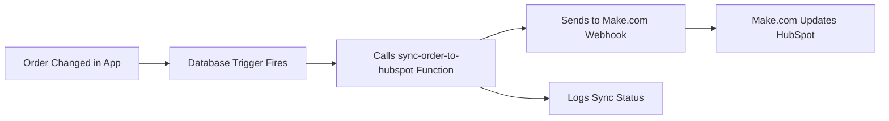

# HubSpot Auto-Sync Setup Guide

## Overview
Your app now has **comprehensive automatic syncing** to HubSpot. Every change to orders is automatically detected by database triggers and sent to HubSpot via Make.com webhooks.

## How It Works



### Automatic Sync Triggers

The system automatically syncs these events:

1. **Order Creation** - New orders created (from payment or manual entry)
2. **Status Updates** - Any status change (pending → assigned → picked-up → in-transit → delivered → completed)
3. **Driver Assignment** - When a driver is assigned or reassigned
4. **Proof of Delivery** - When driver submits POD (photo, signature, notes)
5. **Order Updates** - Changes to addresses, instructions, package details
6. **Payment Updates** - Payment status changes
7. **Delivery Exceptions** - When exceptions are reported

## Setup Steps

### Step 1: Create Make.com Scenarios

You need to create **7 Make.com scenarios** (one for each sync type):

#### Scenario 1: Order Creation
- **Trigger**: Webhook
- **Actions**:
  1. Parse incoming webhook data
  2. Create or update HubSpot Deal
  3. Set deal properties (customer info, addresses, pricing)
  4. Respond with success

#### Scenario 2: Status Update
- **Trigger**: Webhook
- **Actions**:
  1. Parse webhook (contains: deal_id, status, timestamps)
  2. Update HubSpot Deal properties:
     - `order_status`: status
     - `picked_up_at`: picked_up_at
     - `in_transit_at`: in_transit_at
     - `delivered_at`: delivered_at
     - `completed_at`: completed_at
  3. Move deal to appropriate pipeline stage based on status
  4. Respond with success

#### Scenario 3: Driver Assignment
- **Trigger**: Webhook
- **Actions**:
  1. Parse webhook (contains: deal_id, driver_name, driver_phone, assigned_at)
  2. Update HubSpot Deal properties:
     - `assigned_driver`: driver_name
     - `driver_phone`: driver_phone
     - `assigned_at`: assigned_at
  3. Respond with success

#### Scenario 4: Proof of Delivery
- **Trigger**: Webhook
- **Actions**:
  1. Parse webhook (contains: deal_id, photo_url, signature_url, recipient_name)
  2. Update HubSpot Deal properties:
     - `proof_photo`: photo_url
     - `proof_signature`: signature_url
     - `recipient_name`: recipient_name
  3. Optionally: Send confirmation email to customer
  4. Respond with success

#### Scenario 5: Order Update
- **Trigger**: Webhook
- **Actions**:
  1. Parse webhook (contains: deal_id, updated fields, changes object)
  2. Update HubSpot Deal with new values
  3. Optionally: Log changes in HubSpot timeline
  4. Respond with success

#### Scenario 6: Payment Update
- **Trigger**: Webhook
- **Actions**:
  1. Parse webhook (contains: deal_id, payment_status, stripe_session_id)
  2. Update HubSpot Deal properties:
     - `payment_status`: payment_status
     - `stripe_session_id`: stripe_session_id
  3. Respond with success

#### Scenario 7: Delivery Exception
- **Trigger**: Webhook
- **Actions**:
  1. Parse webhook (contains: deal_id, exception_type, exception_notes)
  2. Update HubSpot Deal properties:
     - `delivery_exception`: exception_type
     - `exception_notes`: exception_notes
  3. Create HubSpot task for follow-up
  4. Send notification to dispatcher
  5. Respond with success

### Step 2: Configure Webhook URLs in Admin Dashboard

1. **Log in as Admin**
2. **Navigate to Admin → Webhooks**
3. **For each webhook**, click "Edit" and:
   - Set `is_active` to `true`
   - Paste the Make.com webhook URL you created
   - Click "Save"

The webhook names are:
- `hubspot-order-creation`
- `hubspot-status-update`
- `hubspot-driver-assignment`
- `hubspot-proof-of-delivery`
- `hubspot-order-update`
- `hubspot-payment-update`
- `hubspot-delivery-exception`

### Step 3: Test the Sync

1. **Create a test order** in your app
2. **Check the Admin → Webhooks page** for sync status
3. **Verify in HubSpot** that the deal was created/updated
4. **Update the order** (assign driver, change status, etc.)
5. **Verify each change syncs to HubSpot**

## Sync Status Monitoring

### In the App (Admin → Webhooks):
- View recent sync attempts
- See success/failure status
- Review error messages for failed syncs
- Manually retry failed syncs (feature coming soon)

### In the Database (`hubspot_sync_status` table):
```sql
-- View recent syncs
SELECT * FROM hubspot_sync_status 
ORDER BY created_at DESC 
LIMIT 50;

-- View failed syncs
SELECT * FROM hubspot_sync_status 
WHERE sync_status = 'failed'
ORDER BY last_attempt_at DESC;

-- Count syncs by type
SELECT sync_type, sync_status, COUNT(*) 
FROM hubspot_sync_status 
GROUP BY sync_type, sync_status;
```

## Webhook Payload Examples

### Order Creation
```json
{
  "deal_id": "12345",
  "order_number": "ORD-2025-11-14-abc123",
  "order_id": "uuid",
  "customer_name": "John Doe",
  "customer_email": "john@example.com",
  "customer_phone": "+1234567890",
  "pickup_address": "123 Main St",
  "dropoff_address": "456 Elm St",
  "total_price": 45.00
}
```

### Status Update
```json
{
  "deal_id": "12345",
  "order_number": "ORD-2025-11-14-abc123",
  "order_id": "uuid",
  "status": "in-transit",
  "updated_at": "2025-11-14T22:00:00Z",
  "picked_up_at": "2025-11-14T20:00:00Z",
  "in_transit_at": "2025-11-14T20:30:00Z"
}
```

### Driver Assignment
```json
{
  "deal_id": "12345",
  "order_number": "ORD-2025-11-14-abc123",
  "order_id": "uuid",
  "driver_name": "Jane Smith",
  "driver_phone": "+1987654321",
  "driver_id": "uuid",
  "assigned_at": "2025-11-14T19:00:00Z"
}
```

### Proof of Delivery
```json
{
  "deal_id": "12345",
  "order_number": "ORD-2025-11-14-abc123",
  "order_id": "uuid",
  "proof_photo_url": "https://...",
  "proof_signature_url": "https://...",
  "proof_notes": "Left at front door",
  "recipient_name": "John Doe",
  "delivered_at": "2025-11-14T21:00:00Z"
}
```

## Troubleshooting

### Sync Not Happening
1. **Check webhook is active**: Admin → Webhooks → verify `is_active = true`
2. **Check webhook URL is set**: Make sure Make.com URL is configured
3. **Check Make.com scenario is ON**: Verify scenario is running in Make.com
4. **Check database logs**: Look at `hubspot_sync_status` for errors

### Sync Failing
1. **View error in Admin → Webhooks** sync status section
2. **Common issues**:
   - Invalid webhook URL
   - Make.com scenario is OFF
   - HubSpot API rate limits
   - Invalid deal ID
   - Missing required fields

### Sync Delayed
- Database triggers fire asynchronously
- Normal delay: 1-5 seconds
- If longer: Check Make.com execution history

## Advanced Configuration

### Disabling Specific Sync Types
If you don't want to sync certain events:
1. Go to Admin → Webhooks
2. Find the webhook (e.g., `hubspot-order-update`)
3. Set `is_active` to `false`
4. The trigger will still fire, but sync will be skipped

### Custom Sync Logic
Edit `supabase/functions/sync-order-to-hubspot/index.ts` to:
- Add custom fields to payloads
- Add conditional sync logic
- Transform data before sending

### Retry Failed Syncs
Currently manual - feature coming soon:
```sql
-- Identify failed syncs
SELECT * FROM hubspot_sync_status WHERE sync_status = 'failed';

-- To retry: Update the order to trigger sync again
UPDATE orders SET updated_at = NOW() WHERE id = 'failed_order_id';
```

## Architecture Notes

### Why Database Triggers?
- **Guaranteed execution**: Syncs happen no matter where changes come from (UI, API, direct DB access)
- **Decoupled**: Edge functions run independently of main app code
- **Reliable**: Uses PostgreSQL's ACID guarantees
- **Auditable**: All syncs logged to `hubspot_sync_status`

### Performance Impact
- Minimal: Triggers use `PERFORM` (async)
- Edge function runs in background
- No blocking of main app operations
- pg_net handles HTTP async

### Security
- Service role key used for edge function calls
- Webhook URLs stored securely in database
- RLS policies protect webhook_config table
- All syncs logged for audit trail
