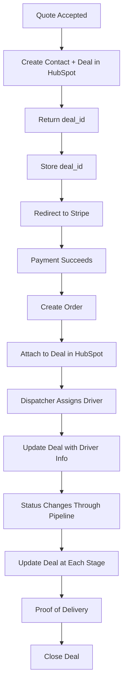

# HubSpot Integration Workflow

## Overview
This document explains the four core webhooks that power the HubSpot integration. These webhooks ensure your delivery app data is automatically mirrored in HubSpot.

## Core Principle
**The app database is the source of truth.** HubSpot mirrors this data for CRM and sales workflows. Data flows one direction: **App → HubSpot**.

## Data Flow Architecture



## The Four Core Webhooks

### Webhook I: Quote Accepted → Create Contact + Deal
**When**: User clicks "Pay Now" after calculating quote  
**Before**: Payment processing (Stripe redirect)  
**Purpose**: Create HubSpot contact and deal to track opportunity  
**Visibility**: ONLY ADMIN can see deals in "New/Order Received" state until payment succeeds

**Edge Function**: `sync-hubspot-quote`  
**Webhook Config**: `hubspot-quote-accepted`

**Payload Sent**:
```json
{
  "customer_name": "John Doe",
  "customer_email": "john@example.com",
  "customer_phone": "+1234567890",
  "pickup_address": "123 Main St",
  "dropoff_address": "456 Elm St",
  "package_description": "Small package",
  "package_weight": 35,
  "distance": 12.5,
  "total_price": 87.50,
  "base_rate": 25.00,
  "mileage_charge": 31.25,
  "surcharge": 31.25,
  "special_instructions": "Handle with care",
  "quote_accepted_at": "2025-11-14T20:00:00Z"
}
```

**Expected Response from Make.com**:
```json
{
  "deal_id": "12345678",
  "contact_id": "87654321"
}
```

**What Happens Next**:
- The `deal_id` is stored in the order's `hubspot_deal_id` field
- When payment succeeds, the order will be linked to this deal
- All future updates reference this same deal

---

### Webhook II: Stripe Checkout Succeeds → Create Order + Attach to Deal
**When**: Stripe checkout completes successfully  
**Trigger**: Database trigger on `orders` table (INSERT)  
**Purpose**: Create order record and attach to deal from Webhook I  
**Result**: Cash is collected, order funnels into dispatcher UI

**Edge Function**: `sync-order-to-hubspot`  
**Webhook Config**: `hubspot-order-creation`  
**Sync Type**: `order-creation`

**Payload Sent**:
```json
{
  "deal_id": "12345678",
  "order_number": "ORD-2025-11-14-abc123",
  "order_id": "uuid",
  "customer_name": "John Doe",
  "customer_email": "john@example.com",
  "customer_phone": "+1234567890",
  "pickup_address": "123 Main St",
  "dropoff_address": "456 Elm St",
  "package_description": "Small package",
  "special_instructions": "Handle with care",
  "total_price": 87.50,
  "payment_status": "paid",
  "status": "pending"
}
```

---

### Webhook III: Driver Assignment → Deal Pipeline Update
**When**: Dispatcher selects and assigns a driver to an order  
**Trigger**: Database trigger on `orders` table (UPDATE driver_id)  
**Purpose**: Update HubSpot deal with driver information  
**Response**: Webhook confirms assignment and signals sync in HubSpot

**Edge Function**: `sync-order-to-hubspot`  
**Webhook Config**: `hubspot-driver-assignment`  
**Sync Type**: `driver-assignment`

**Payload Sent**:
```json
{
  "deal_id": "12345678",
  "order_number": "ORD-2025-11-14-abc123",
  "order_id": "uuid",
  "driver_name": "Jane Smith",
  "driver_phone": "+1987654321",
  "driver_id": "uuid",
  "assigned_at": "2025-11-14T19:00:00Z"
}
```

---

### Webhook IV: Order Status Updates → Pipeline Progression
**When**: Order status changes through the delivery lifecycle  
**Trigger**: Database trigger on `orders` table (UPDATE status)  
**Purpose**: Update HubSpot deal pipeline stage AND populate stage-specific data  
**Note**: Each status update includes ALL available fields, even if empty

**Edge Function**: `sync-order-to-hubspot`  
**Webhook Config**: `hubspot-status-update`  
**Sync Type**: `status-update`

**Payload Sent**:
```json
{
  "deal_id": "12345678",
  "order_number": "ORD-2025-11-14-abc123",
  "order_id": "uuid",
  "status": "in-transit",
  "updated_at": "2025-11-14T22:00:00Z",
  "picked_up_at": "2025-11-14T20:00:00Z",
  "in_transit_at": "2025-11-14T20:30:00Z"
}
```

**Complete Pipeline Mapping**:
- `pending` → **New/Order Received** (pre-Stripe success, admin-only visibility)
- `assigned` → **Accepted/Scheduled** (includes scheduled pickup/delivery times + locations)
- `assigned` (with driver) → **Driver Assigned**
- `picked-up` → **In Progress/Out for Pickup**
- `picked-up` (confirmed) → **Picked Up** (includes actual pickup time)
- `in-transit` → **In Transit**
- `delivered` → **Delivered** (includes actual delivery time + PoD URL)
- `completed` → **Completed/Closed** (includes driver feedback from customer)
- `cancelled` → **Cancelled**
- Status exceptions → **Failed/RTS** (Return to Sender)

**Field Availability**: All fields are sent with every status update, even if empty. This ensures HubSpot always has complete data structure.

---

### Additional Sync: Proof of Delivery
**When**: Driver submits proof of delivery (photo, signature, notes)  
**Trigger**: Database trigger on `proof_of_delivery` table (INSERT)  
**Purpose**: Document delivery completion and close deal in HubSpot  
**Included in**: Webhook IV (Status Update to "delivered")

**Edge Function**: `sync-order-to-hubspot`  
**Webhook Config**: `hubspot-proof-of-delivery`  
**Sync Type**: `proof-of-delivery`

**Payload Sent**:
```json
{
  "deal_id": "12345678",
  "order_number": "ORD-2025-11-14-abc123",
  "order_id": "uuid",
  "proof_photo_url": "https://storage.supabase.co/...",
  "proof_signature_url": "https://storage.supabase.co/...",
  "proof_notes": "Left at front door",
  "recipient_name": "John Doe",
  "delivered_at": "2025-11-14T21:00:00Z"
}
```

---

### Additional Sync: Payment Updates
**When**: Payment status changes (e.g., refund processed)  
**Trigger**: Database trigger on `orders` table (UPDATE payment_status)  
**Purpose**: Keep HubSpot financial records accurate  
**Note**: Rare event after initial payment

**Edge Function**: `sync-order-to-hubspot`  
**Webhook Config**: `hubspot-payment-update`  
**Sync Type**: `payment-update`

**Payload Sent**:
```json
{
  "deal_id": "12345678",
  "order_number": "ORD-2025-11-14-abc123",
  "order_id": "uuid",
  "payment_status": "refunded",
  "stripe_session_id": "cs_test_...",
  "total_price": 87.50
}
```

---

### Additional Sync: Delivery Exceptions
**When**: Driver reports delivery issue (e.g., recipient not home)  
**Trigger**: Database trigger on `orders` table (UPDATE delivery_exception_type)  
**Purpose**: Write exception details into HubSpot for follow-up  
**Examples**: Customer unavailable, wrong address, access denied

**Edge Function**: `sync-order-to-hubspot`  
**Webhook Config**: `hubspot-delivery-exception`  
**Sync Type**: `delivery-exception`

**Payload Sent**:
```json
{
  "deal_id": "12345678",
  "order_number": "ORD-2025-11-14-abc123",
  "order_id": "uuid",
  "exception_type": "recipient_unavailable",
  "exception_notes": "Customer not home, left note",
  "driver_contacted_customer": true,
  "driver_feedback": "Customer will pick up tomorrow"
}
```

---

## Setup Instructions

### Step 1: Configure Make.com Webhooks

For each sync event above, create a Make.com scenario:

1. **Add Webhook Trigger** (Custom Webhook)
2. **Parse JSON** from incoming webhook
3. **HubSpot Action** (Create/Update Contact, Deal, etc.)
4. **Respond** with success confirmation

Copy each webhook URL from Make.com.

### Step 2: Configure in Admin Dashboard

1. Log in as Admin
2. Navigate to **Admin → Webhooks**
3. For each webhook:
   - Click **Edit**
   - Set `is_active` to `true`
   - Paste the Make.com webhook URL
   - Click **Save**

### Step 3: Test End-to-End

1. **Create a test quote** on the Quote page
2. Click **Pay Now** (use Stripe test card: `4242 4242 4242 4242`)
3. **Verify in HubSpot**: Contact and Deal created
4. **Assign a driver** in Dispatcher Dashboard
5. **Verify in HubSpot**: Driver info added to deal
6. **Update order status** through the driver app
7. **Verify in HubSpot**: Deal moves through pipeline
8. **Submit proof of delivery**
9. **Verify in HubSpot**: Deal marked as Closed Won

---

## Key Architecture Decisions

### ✅ Four Core Webhooks Only
These four webhooks handle the entire lifecycle:
1. **Quote Accepted** - Creates opportunity in HubSpot
2. **Order Created** - Converts opportunity to active order
3. **Driver Assigned** - Updates deal with fulfillment info
4. **Status Updates** - Moves deal through pipeline with stage-specific data

### ✅ Automatic Database Triggers
- **No manual syncing** - Database triggers fire automatically
- **No missed updates** - Every relevant change syncs
- **UI-agnostic** - Works regardless of how data changes

### ✅ Quote-First Workflow
- Quote creates deal **before** payment
- Abandoned carts = deals without orders
- Sales can follow up on abandoned quotes

### ✅ Complete Field Mapping
- **All fields sent** - Even if empty/null
- **No missing data** - HubSpot always has full structure
- **Stage-specific context** - Relevant fields for each pipeline stage

### ✅ App as Source of Truth
- **App database** = source of truth
- **HubSpot** = CRM mirror
- **One-way sync**: App → HubSpot

---

## Monitoring & Troubleshooting

### View Sync Status
Admin Dashboard → Webhooks shows:
- Recent sync attempts
- Success/failure status
- Error messages
- Last sync timestamp

### Database Tables
```sql
-- View sync history
SELECT * FROM hubspot_sync_status 
ORDER BY created_at DESC LIMIT 50;

-- View webhook logs
SELECT * FROM webhook_logs 
WHERE webhook_name LIKE 'hubspot-%'
ORDER BY created_at DESC LIMIT 50;

-- Check failed syncs
SELECT * FROM hubspot_sync_status 
WHERE sync_status = 'failed';
```

### Common Issues
1. **Webhook not configured**: Set `is_active = true` and add URL
2. **Make.com scenario OFF**: Turn on scenario in Make.com
3. **Invalid deal_id**: Quote sync may have failed
4. **Rate limiting**: HubSpot API limits exceeded

---

## Abandoned Quotes

Deals created from quotes (Step 1) but with no successful payment are considered **abandoned**:
- Deal remains in HubSpot as "Open"
- No order is created in app
- Use for sales follow-up: "Why didn't you complete checkout?"
