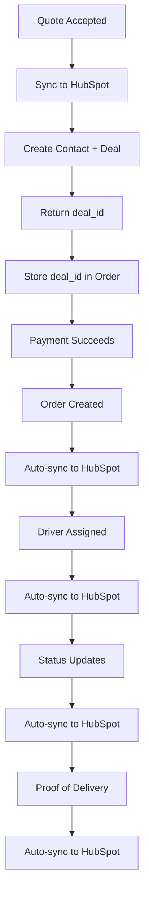

# HubSpot Integration Workflow

## Overview
This document explains how your delivery app syncs with HubSpot through Make.com webhooks at each stage of the order lifecycle.

## Data Flow Architecture



## Sync Events

### 1. Quote Accepted → Create Contact + Deal
**When**: User clicks "Pay Now" after calculating quote  
**Before**: Payment processing  
**Purpose**: Create HubSpot contact and deal to track the opportunity

**Edge Function**: `sync-hubspot-quote`  
**Webhook Config**: `hubspot-quote-accepted`

**Payload Sent**:
```json
{
  "customer_name": "John Doe",
  "customer_email": "john@example.com",
  "customer_phone": "+1234567890",
  "pickup_address": "123 Main St",
  "dropoff_address": "456 Elm St",
  "package_description": "Small package",
  "package_weight": 35,
  "distance": 12.5,
  "total_price": 87.50,
  "base_rate": 25.00,
  "mileage_charge": 31.25,
  "surcharge": 31.25,
  "special_instructions": "Handle with care",
  "quote_accepted_at": "2025-11-14T20:00:00Z"
}
```

**Expected Response from Make.com**:
```json
{
  "deal_id": "12345678",
  "contact_id": "87654321"
}
```

**What Happens Next**:
- The `deal_id` is stored in the order's `hubspot_deal_id` field
- When payment succeeds, the order will be linked to this deal
- All future updates reference this same deal

---

### 2. Payment Succeeds → Order Created
**When**: Stripe checkout completes successfully  
**Trigger**: Database trigger on `orders` table (INSERT)  
**Purpose**: Attach order to existing HubSpot deal

**Edge Function**: `sync-order-to-hubspot`  
**Webhook Config**: `hubspot-order-creation`  
**Sync Type**: `order-creation`

**Payload Sent**:
```json
{
  "deal_id": "12345678",
  "order_number": "ORD-2025-11-14-abc123",
  "order_id": "uuid",
  "customer_name": "John Doe",
  "customer_email": "john@example.com",
  "customer_phone": "+1234567890",
  "pickup_address": "123 Main St",
  "dropoff_address": "456 Elm St",
  "package_description": "Small package",
  "special_instructions": "Handle with care",
  "total_price": 87.50,
  "payment_status": "paid",
  "status": "pending"
}
```

---

### 3. Driver Assignment
**When**: Dispatcher assigns a driver to an order  
**Trigger**: Database trigger on `orders` table (UPDATE driver_id)  
**Purpose**: Update HubSpot with driver information

**Edge Function**: `sync-order-to-hubspot`  
**Webhook Config**: `hubspot-driver-assignment`  
**Sync Type**: `driver-assignment`

**Payload Sent**:
```json
{
  "deal_id": "12345678",
  "order_number": "ORD-2025-11-14-abc123",
  "order_id": "uuid",
  "driver_name": "Jane Smith",
  "driver_phone": "+1987654321",
  "driver_id": "uuid",
  "assigned_at": "2025-11-14T19:00:00Z"
}
```

---

### 4. Order Status Updates
**When**: Order status changes (pending → assigned → picked-up → in-transit → delivered → completed)  
**Trigger**: Database trigger on `orders` table (UPDATE status)  
**Purpose**: Keep HubSpot deal pipeline in sync

**Edge Function**: `sync-order-to-hubspot`  
**Webhook Config**: `hubspot-status-update`  
**Sync Type**: `status-update`

**Payload Sent**:
```json
{
  "deal_id": "12345678",
  "order_number": "ORD-2025-11-14-abc123",
  "order_id": "uuid",
  "status": "in-transit",
  "updated_at": "2025-11-14T22:00:00Z",
  "picked_up_at": "2025-11-14T20:00:00Z",
  "in_transit_at": "2025-11-14T20:30:00Z"
}
```

**Status Mapping to HubSpot Pipeline**:
- `pending` → New Deal
- `assigned` → Driver Assigned
- `picked-up` → Picked Up
- `in-transit` → In Transit
- `delivered` → Delivered
- `completed` → Closed Won

---

### 5. Proof of Delivery
**When**: Driver submits proof of delivery (photo, signature, notes)  
**Trigger**: Database trigger on `proof_of_delivery` table (INSERT)  
**Purpose**: Document delivery completion in HubSpot

**Edge Function**: `sync-order-to-hubspot`  
**Webhook Config**: `hubspot-proof-of-delivery`  
**Sync Type**: `proof-of-delivery`

**Payload Sent**:
```json
{
  "deal_id": "12345678",
  "order_number": "ORD-2025-11-14-abc123",
  "order_id": "uuid",
  "proof_photo_url": "https://storage.supabase.co/...",
  "proof_signature_url": "https://storage.supabase.co/...",
  "proof_notes": "Left at front door",
  "recipient_name": "John Doe",
  "delivered_at": "2025-11-14T21:00:00Z"
}
```

---

### 6. Payment Updates
**When**: Payment status changes (e.g., refund processed)  
**Trigger**: Database trigger on `orders` table (UPDATE payment_status)  
**Purpose**: Keep HubSpot financial records accurate

**Edge Function**: `sync-order-to-hubspot`  
**Webhook Config**: `hubspot-payment-update`  
**Sync Type**: `payment-update`

**Payload Sent**:
```json
{
  "deal_id": "12345678",
  "order_number": "ORD-2025-11-14-abc123",
  "order_id": "uuid",
  "payment_status": "refunded",
  "stripe_session_id": "cs_test_...",
  "total_price": 87.50
}
```

---

### 7. Delivery Exceptions
**When**: Driver reports delivery issue (e.g., recipient not home)  
**Trigger**: Database trigger on `orders` table (UPDATE delivery_exception_type)  
**Purpose**: Alert in HubSpot for follow-up action

**Edge Function**: `sync-order-to-hubspot`  
**Webhook Config**: `hubspot-delivery-exception`  
**Sync Type**: `delivery-exception`

**Payload Sent**:
```json
{
  "deal_id": "12345678",
  "order_number": "ORD-2025-11-14-abc123",
  "order_id": "uuid",
  "exception_type": "recipient_unavailable",
  "exception_notes": "Customer not home, left note",
  "driver_contacted_customer": true,
  "driver_feedback": "Customer will pick up tomorrow"
}
```

---

## Setup Instructions

### Step 1: Configure Make.com Webhooks

For each sync event above, create a Make.com scenario:

1. **Add Webhook Trigger** (Custom Webhook)
2. **Parse JSON** from incoming webhook
3. **HubSpot Action** (Create/Update Contact, Deal, etc.)
4. **Respond** with success confirmation

Copy each webhook URL from Make.com.

### Step 2: Configure in Admin Dashboard

1. Log in as Admin
2. Navigate to **Admin → Webhooks**
3. For each webhook:
   - Click **Edit**
   - Set `is_active` to `true`
   - Paste the Make.com webhook URL
   - Click **Save**

### Step 3: Test End-to-End

1. **Create a test quote** on the Quote page
2. Click **Pay Now** (use Stripe test card: `4242 4242 4242 4242`)
3. **Verify in HubSpot**: Contact and Deal created
4. **Assign a driver** in Dispatcher Dashboard
5. **Verify in HubSpot**: Driver info added to deal
6. **Update order status** through the driver app
7. **Verify in HubSpot**: Deal moves through pipeline
8. **Submit proof of delivery**
9. **Verify in HubSpot**: Deal marked as Closed Won

---

## Key Differences from Standard Approach

### ✅ Automatic Syncing
- **No manual button clicks** - Everything syncs automatically
- **Database triggers** ensure no changes are missed
- **Works regardless of UI** - Direct DB changes also sync

### ✅ Quote Before Payment
- Quote creates the HubSpot deal **before** payment
- Order inherits the `deal_id` when payment succeeds
- Ensures all quotes are tracked, even if payment fails

### ✅ Single Source of Truth
- **App database** is the source of truth
- **HubSpot** is the mirror for sales/CRM workflows
- Data flows **one direction**: App → HubSpot

---

## Monitoring & Troubleshooting

### View Sync Status
Admin Dashboard → Webhooks shows:
- Recent sync attempts
- Success/failure status
- Error messages
- Last sync timestamp

### Database Tables
```sql
-- View sync history
SELECT * FROM hubspot_sync_status 
ORDER BY created_at DESC LIMIT 50;

-- View webhook logs
SELECT * FROM webhook_logs 
WHERE webhook_name LIKE 'hubspot-%'
ORDER BY created_at DESC LIMIT 50;

-- Check failed syncs
SELECT * FROM hubspot_sync_status 
WHERE sync_status = 'failed';
```

### Common Issues
1. **Webhook not configured**: Set `is_active = true` and add URL
2. **Make.com scenario OFF**: Turn on scenario in Make.com
3. **Invalid deal_id**: Quote sync may have failed
4. **Rate limiting**: HubSpot API limits exceeded

---

## Abandoned Quotes

Deals created from quotes (Step 1) but with no successful payment are considered **abandoned**:
- Deal remains in HubSpot as "Open"
- No order is created in app
- Use for sales follow-up: "Why didn't you complete checkout?"
